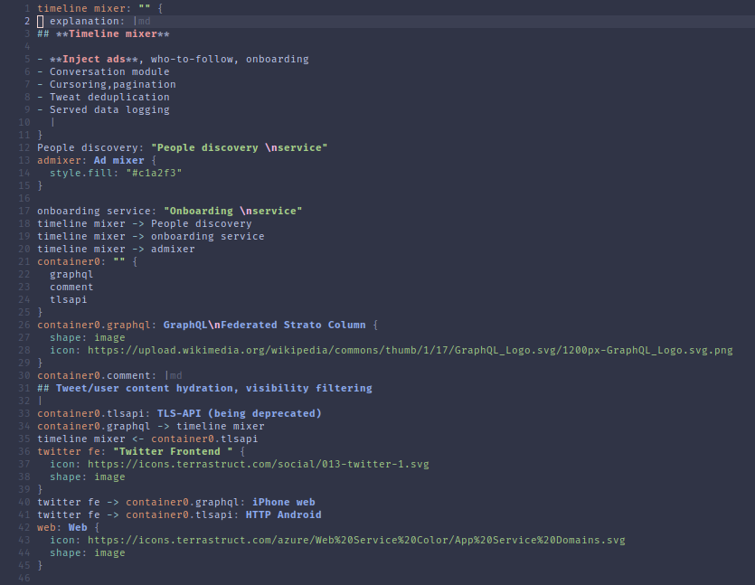

# tree-sitter-d2

d2 grammar for tree-sitter.

References:
- https://d2lang.com/

## Highlights




# Install

## Neovim

Using `nvim-treesitter`, add to your configuration

```lua
local parser_config = require("nvim-treesitter.parsers").get_parser_configs()
parser_config.d2 = {
  install_info = {
    url = 'https://github.com/pleshevskiy/tree-sitter-d2',
    revision = 'main'
    files = { 'src/parser.c', 'src/scanner.cc' },
  },
  filetype = 'd2',
};
```

